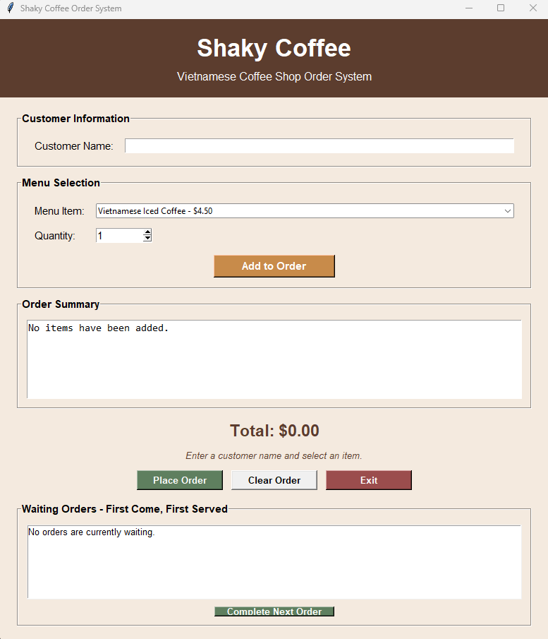
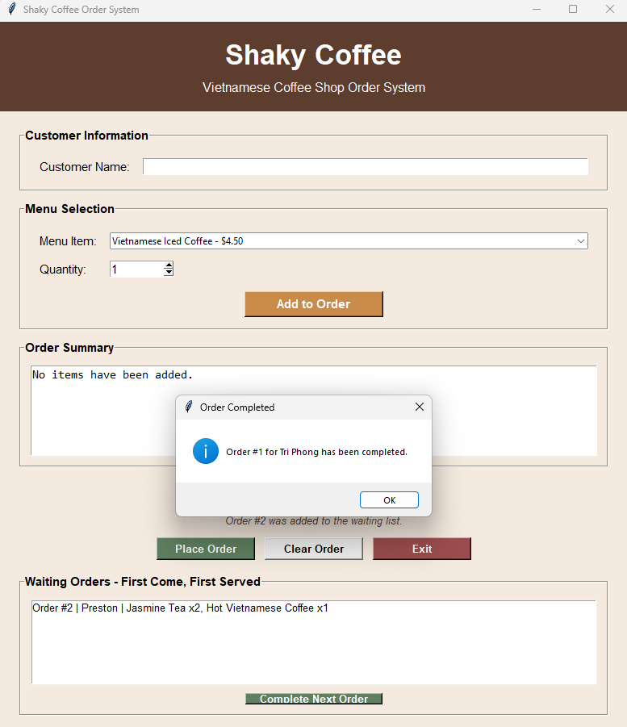

# Shaky Coffee Order System Final Report

## Project Summary

The Shaky Coffee Order System is a Python application created for an imaginary Vietnamese local coffee shop. The program uses a Tkinter graphical interface to help enter customer orders, calculate totals, and organize placed orders in a first-come-first-served waiting list.

The completed application uses three main classes: `Customer`, `MenuItem`, and `Order`. It also uses Python lists and dictionaries to manage menu items, current-order information, and waiting orders.

## Completed Features

The final system includes the following features:

- Customer name entry
- Menu items with displayed prices
- Quantity selection from 1 to 10
- Addition of items to the current order
- Combination of repeated menu items
- Automatic total calculation
- Current-order summary
- Input validation
- Clear Order button
- Place Order button
- First-come-first-served waiting list
- Complete Next Order button
- Exit confirmation
- Status messages for completed actions

## Problems Encountered and Corrections

### Window size

During early testing, the Place Order, Clear Order, and Exit buttons were not visible because the program window was too short.

This problem was corrected by increasing the window dimensions and allowing enough space for all interface sections.

### Quantity validation

The original quantity field allowed a user to manually enter invalid values, including text or numbers greater than 10.

This problem was corrected by checking that the quantity is a whole number between 1 and 10. The system now displays a warning and resets the quantity when invalid input is entered.

### Repeated menu items

Originally, adding the same menu item more than once created separate lines in the order summary.

The `Order` class was updated so repeated items are combined. For example, adding one coffee and then adding two more displays the item once with a quantity of three.

### Order processing

The original Place Order button only displayed a completion message. It did not provide employees with a useful way to organize placed orders.

A waiting-order list was added. Each placed order now receives an order number and displays the customer name and order details. The Complete Next Order button removes the oldest waiting order first.

## System Test Results

| Test | Expected Result | Actual Result | Status |
|---|---|---|---|
| Start the program | The graphical interface opens without errors | The interface opened successfully | Passed |
| Blank customer name | A warning asks for a customer name | The warning displayed correctly | Passed |
| Text entered as quantity | A whole-number warning appears | The warning displayed and quantity reset to 1 | Passed |
| Quantity greater than 10 | A range warning appears | The warning displayed correctly | Passed |
| Add one menu item | The item and correct price appear | The item appeared correctly | Passed |
| Add multiple items | All items and the correct total appear | The summary and total were correct | Passed |
| Add the same item again | Quantities are combined | The repeated item was combined correctly | Passed |
| Clear current order | Current inputs clear and total returns to $0.00 | The current order reset correctly | Passed |
| Place an order | The order is added to the waiting list | The order appeared with its number, customer, and details | Passed |
| Place multiple orders | Orders remain in the order received | Orders appeared in first-come-first-served order | Passed |
| Complete next order | The oldest waiting order is removed first | The first order was completed and removed | Passed |
| Complete with no waiting orders | A warning appears | The warning displayed correctly | Passed |
| Exit and select No | The program remains open | The program remained open | Passed |
| Exit and select Yes | The program closes normally | The program closed without errors | Passed |

## Sample Output

The following screenshots demonstrate the completed system:

### Main Window

### Current Order

### Waiting Orders

### Completed Order

## Final Results

The completed Shaky Coffee Order System meets the project requirements. It contains a graphical user-friendly interface, interacts with three classes, uses Python collections, validates input, calculates totals correctly, and processes waiting orders in first-come-first-served order.

All final test cases passed, and the program ran without syntax or runtime errors during testing.