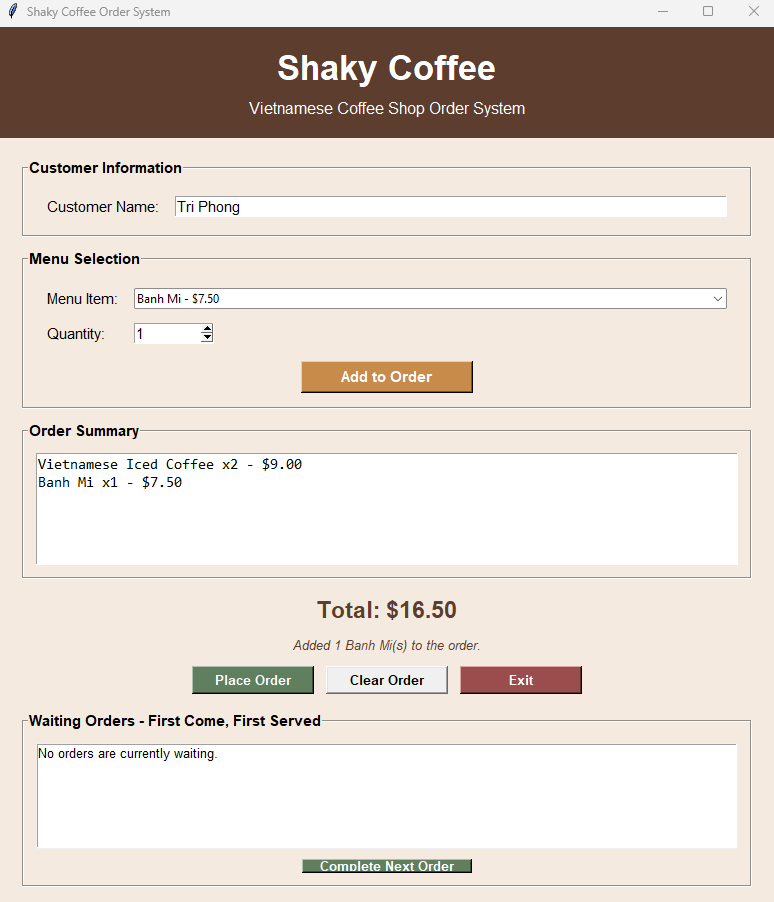
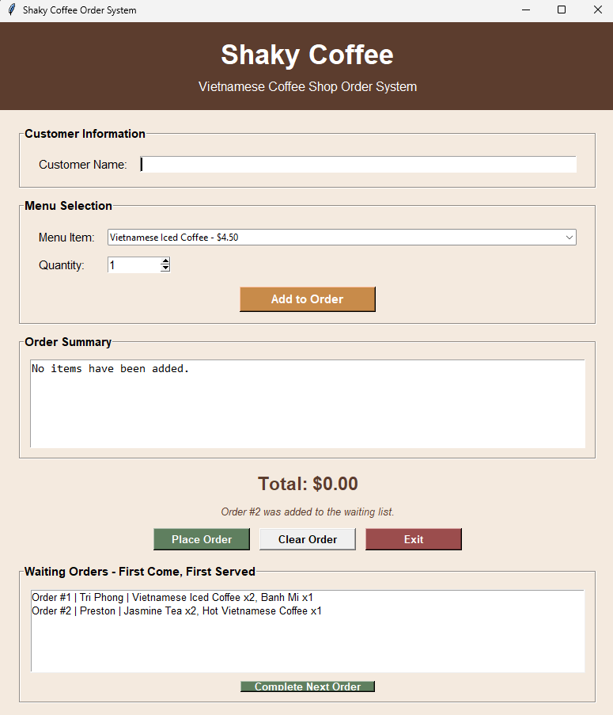

# Shaky Coffee Order System

## Project Description

The Shaky Coffee Order System is a Python application created for an imaginary Vietnamese local coffee shop. It allows a user to enter customer orders, calculate totals, and organize placed orders in a first-come-first-served waiting list.

The system was created with Python and Tkinter and is designed to provide a simple, user-friendly interface for coffee shop order management.

## Final Features

- Graphical interface created with Tkinter
- Customer name entry
- Menu items with displayed prices
- Quantity selection from 1 to 10
- Add items to a current order
- Combine repeated menu items
- Automatic total calculation
- Current-order summary
- Input validation and warning messages
- Clear the current order
- Place orders into a waiting list
- Assign a unique number to each order
- Display customer names and order details
- Complete orders in first-come-first-served order
- Exit confirmation
- Status messages

## Classes

The system contains three main classes:

### Customer

Stores the customer's name and provides a method for retrieving it.

### MenuItem

Stores each menu item's name, price, and category. It also provides a method for displaying the item with its price.

### Order

Stores selected menu items and quantities. It combines repeated items, calculates totals, produces order summaries, creates order details, and clears the current order.

## Python Collections

The program uses:

- A list to store available menu items
- A list to store items in the current order
- Dictionaries to connect menu items with quantities
- A list to store waiting orders
- Dictionaries to store each waiting order's number, customer name, and order details

## How to Run the Program

1. Download or clone this repository.
2. Make sure Python is installed.
3. Open the project folder.
4. Run the following command:

```bash
python main.py
```

Tkinter is included with most standard Python installations, so no additional packages are required.

## Documentation

- [Project Proposal](Project_Proposal.md)
- [Final Report and Test Results](Final_Report.md)
- [UML Class Diagram](UML_Diagram.png)
- [Sample Output Screenshots](screenshots/)

## Sample Output

### Current Order



### Waiting Orders



## Project Status

The final version of the Shaky Coffee Order System is complete. The system was tested successfully and ran without syntax or runtime errors. All planned order-entry, calculation, validation, waiting-list, and first-come-first-served processing features are working.